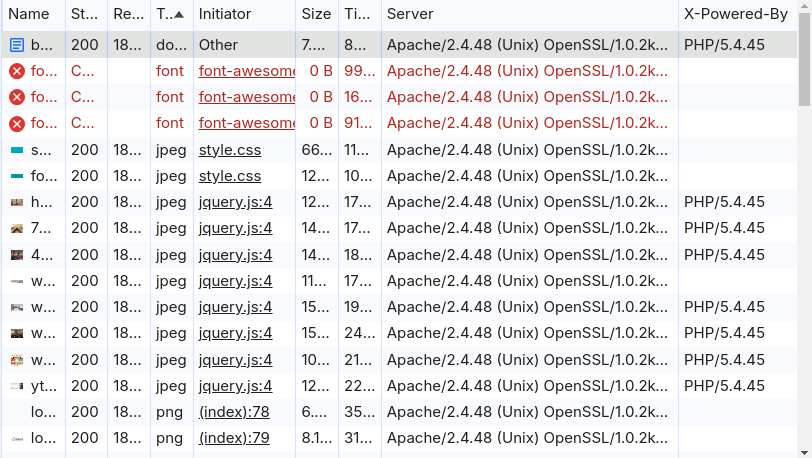
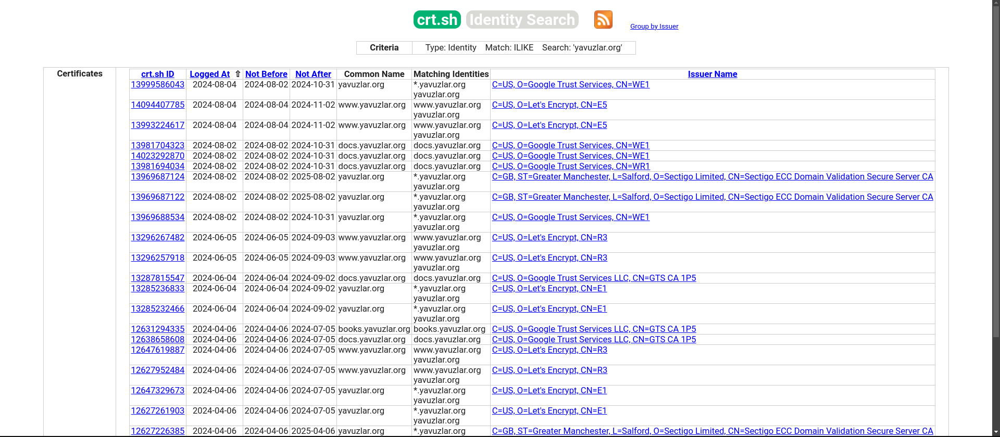

# gokuk scan

Bu araç [Golang](https://go.dev/) ile oluşturulmuştur. Bu araçla, parametre olarak verdiğiniz web sitesini tarayabilirsiniz.

------

- DNS Record
    - MX Record
    - NS Record
    - A Record (IPv4)
    - AAAA Record (IPv6)
    - TXT Record
- Check robots.txt file
- Subdomain Scan
- Directory Scan
- Web Server Infos

 ### Parametreler

```
 -d, --DNS Record Type string           A Record: IPv4 address
                                         AAAA Record:Ipv6 address
                                         MX Record:Mail record
                                         NS Record:Name server record
                                         TXT Record:Domain info text (default "A-AAAA-NS-MX-TXT")
  -f, --Filter HTTP Status Code string   You can filter HTTP Statsus Code with -f parameter (default "200,404")
  -c, --count int                        Request count (default 10)
  -h, --help                             help for Cyrops
      --no-robots                        Disable the robots.txt feature
  -r, --robots                           With default value the tool check the robots.txt file (default true)
  -s, --subdomain-wordlist string        You can specify Subdomain Wordlist (default "wordlist/seclistSubdomains5000.txt")
  -u, --url string                       You need to specify URL
  -v, --version                          version for Cyrops
  -w, --wordlist string                  You can specify Directory Wordlist (default "wordlist/seclistWebContent.txt")
```
### robots.txt

Hedef sitede robots.txt dosyasının olup olmadığını kontrol etmek için kullanılan bir parametredir. -r ile kontrol edilir.

### Dizin taraması

Parametre olarak verilen url üzerinde brute force denerek dosyaların varlığı kontrol edilir.

### Location

Elde edilen IP değerleriyle birlikte ülkelerin sahip olmuş olduğu IP bloklarına göre karşılaştırılıp lokasyon belirlemesi yapılır. Ülkerele ait IP bloklarına [buradan](https://lite.ip2location.com/ip-address-ranges-by-country) ulaşabilirsiniz.

### Kullanılan Teknolojiler

Web sitesinde kullanılan teknolojileri öğrenmek için giden gelen paketlerin incelenmesi gerekiyor. Sitenin bize dönen cevabında Serve başlığında hangi web sunucusunu kullandığını tanımlamak için kullanılabilir. Eğer DevTools sekmesini biraz karıştırıp farklı özelliklerin görünmesini sağlayabilirseniz server tipini ve arka tarafta çalışan dil hakkında bilgi edineilirsiniz. Ayrıca kaynak kodlara ve JavaScript dosyalarında bulunan global değişken isimleriyle sistemin teknolojileri hakkında bilgi edinebiliriz.

<figure>

</figure>


Bu projede kullandığımız kütüphanede benzer şekilde yaptığımız taramaları otomatize ederek sistem hakkında bize bilgi sağlamaya çalışır. 

### Subdomain

Brute force ile subdomain bulma yöntemi gibi çeşitli yöntemler vardır. Wordlistler kullanarak subdomain taraması yapılabilir ama bu tarama yöntemi bize daha uzun bir sürede daha az bir bilgi sağlayacaktır. 

Daha fazla subdomain elde edebilmek için SSL/TLS sertifikalarının bilgilerinin saklandığı bir database olan ```crt.sh``` web sitesinden gerekli içerikleri alabiliriz.

<figure>

</figure>

Google, Yahoo, Bing, Baidu ve Ask gibi birçok arama motorunu kullanarak alt alan adlarını toplayabiliriz.

Pasif DNS (pDNS) dediğimiz, hem aktif hem de inaktif subdomainleri içinde barındıran bir DNs veritabanı üzerinden sorgu yaparak da subdomainleri elde edebiliriz. Gerçek zamanlı DNS sorgularının ve bu sorgulara verilen yanıtların kaydedilmesi ile Pasif DNS veritabanı oluşmuş olur. Bu süreçte DNS sunucularına herhangi bir müdahale veya aktif sorgulama yapılmaz.

Örnekler:

``go run .\main.go -h``

-----
``go run .\main.go -u https://www.karabuk.edu.tr/``

------
``go run .\main.go -u https://www.karabuk.edu.tr/ -w <dirWordlist>``

------
``go run .\main.go -u https://www.karabuk.edu.tr/ -f 200``

------
``go run .\main.go -u https://www.karabuk.edu.tr/ -r``

